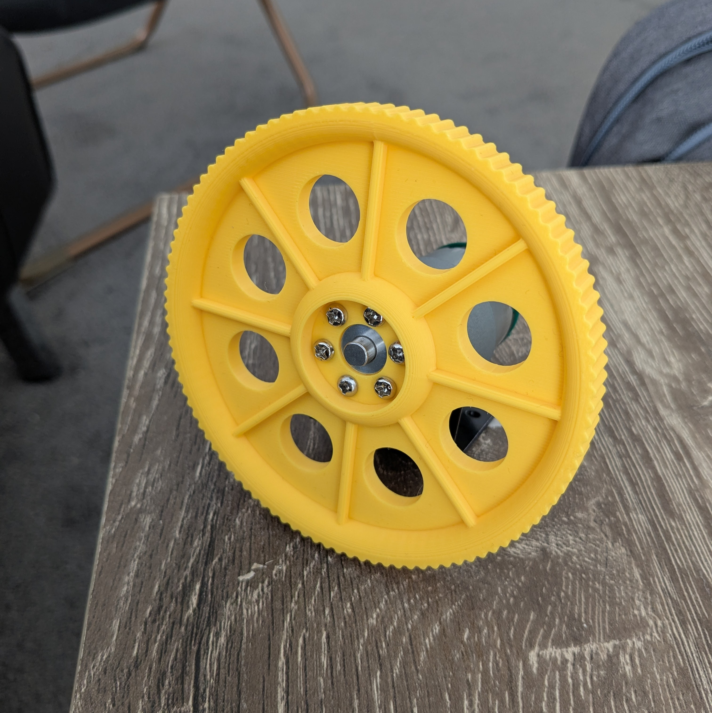

# Parts

## 104mm-tread-6mm-mounting-hub-wheel.stl
- Diameter: 104mm (100mm without tread)
- Width: 10mm
- Designed to be used with [Pololu Universal Mounting Hub for 6mm Shaft](https://core-electronics.com.au/pololu-universal-aluminum-mounting-hub-for-6mm-shaft-m3-holes-2-pack.html)
- Printed flat side down with no supports (Bambu Lab Standard mode, approx. 1 hour print time)
- Materials: PLA for prototyping on soft indoor surfaces, such as carpet, PETG for durability and better performance on hard outdoor surfaces, such as concrete and asphalt.

## 2020-3way-corner-bracket.stl
- Designed to be used with 2020 aluminum extrusion
- Can hold 3 pieces of extrusion at 90 degree angles to each other (using M3 screws and T-nuts)
- Printed flat side down with no supports (Bambu Lab Standard mode, approx. 15 minute print time)
- Materials: PLA for prototyping, PETG for durability.